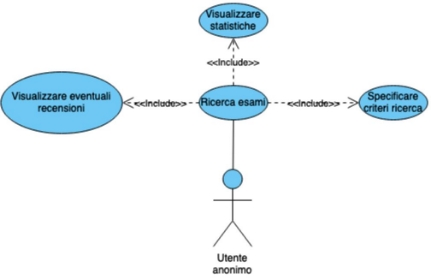
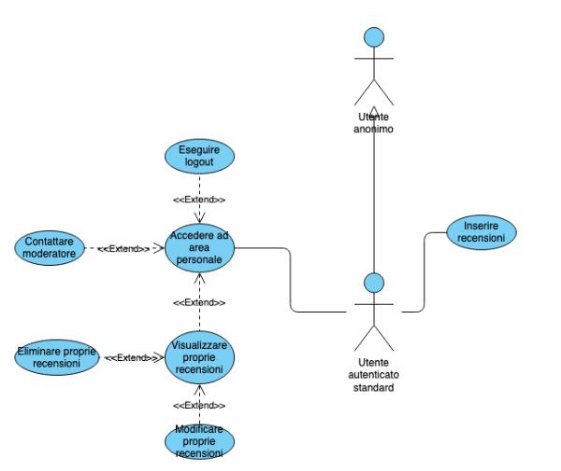
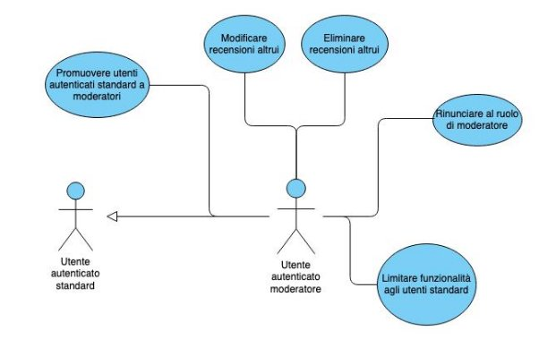
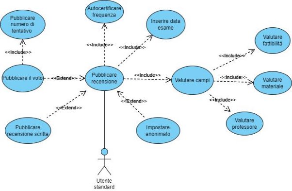
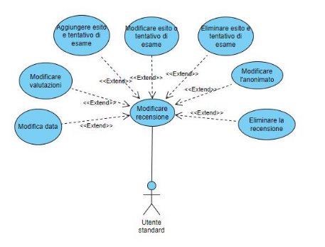
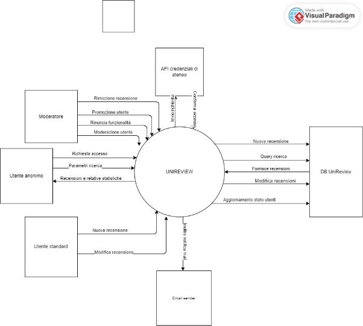

**UNIREVIEW**

**Scopo del documento**

In questo documento verranno discusse le specifiche della webapp “Unireview” con relativi diagrammi UML e tabelle. Di seguito sono anche descritti gli obiettivi del progetto utilizzando linguaggio “naturale”. Alla fine verranno anche presentati i diagrammi di contesto e dei componenti in relazione ai requisiti funzionali descritti.

**1 Requisiti Funzionali**

Nel presente capitolo vengono elencati i requisiti funzionali sotto forma di Use Case Diagram.

1. **Requisiti di accesso**

Descrizione:

La web app permette il proprio utilizzo a due tipologie di

utenti:

- Utenti anonimi: non necessitano di effettuare il login
- Utenti autenticati: necessitano di effettuare il login con credenziali universitarie. Sono suddivisi in:
  - Utente standard
  - Utente moderatore
2. **Descrizione del livello di accesso Utenti anonimi**

Titolo: accessibilità dell’utente anonimo

Descrizione:

- l’utente anonimo ha solo la possibilità di effettuare la ricerca degli esami. Questo include vederne i risultati, statistiche e inserire filtri.
- A questo livello si ha la possibilità di fare il login per autenticarsi tramite pulsante inserito nella landing page

**Utenti autenticati**

Titolo: accessibilità dell’utente autenticato standard Descrizione:

- Questo stato offre le stesse funzionalità dell’utente anonimo
- Viene offerta la possibilità di inserire recensioni
- All’utente standard viene data la possibilità di pubblicare recensioni
- L’utente standard può accedere a un’area personale

**Descrizione dello use case “accedere ad area personale”**

Dalla landing page l’utente standard può accedere a un’area personale dalla quale può

- eseguire il logout e contattare moderatori tramite appositi bottoni
- contattare moderatori tramite

**Utenti moderatori**

Titolo: accessibilità dell’utente moderatore

Descrizione: oltre alle funzionalità dell’utente standard, ha la possibilità di:

- limitare le funzionalità degli utenti da apposita sezione nell’area personale o aumentarle promuovendoli a moderatori
- rimuovere le recensioni che visualizza attraverso apposito pulsante
- rinunciare alle funzionalità di moderatore tramite apposito pulsante nell’area personale
3. **Compilazione recensione**

Descrizione: L’applicazione permette di compilare una            scheda di valutazione suddivisa in tre parametri valutabili in quinti.

Viene richiesto all’utente di specificare inoltre:

- L’esito dell’esame (con eventuale voto conseguito e numero di tentativi)
- Tasso di frequenza
- Opzionale recensione scritta

Viene data la possibilità all’utente di scegliere se pubblicare la recensione in forma anonima o pubblica.

4. **Ricerca di un esame**

Descrizione: L’utente ha la possibilità di effettuare una ricerca nell’archivio tramite il nome dell’esame.

I risultati possono poi venire filtrati e ordinati

5. **Visualizzazione delle statistiche**

Descrizione: l’utente, inserendo una parola chiave in una barra di ricerca nella landing page, avvia una ricerca che mostra le statistiche relative ai risultati trovati

6. **Descrizione use case “Pubblica recensione”**

Titolo: compilazione di una recensione Riassunto: l’utente compila una nuova recensione Descrizione:

1. L’utente effettua la ricerca di un esame e lo seleziona
1. All’utente è richiesto inserire le valutazioni in quinti dell’esame riempiendo i tre campi (fattibilità, materiale, professore)
1. L’utente deve certificare la propria frequenza al corso
4. L’utente ha anche la possibilità di inserire una recensione scritta e aggiungere il voto conseguito all’esame [exception 1]
4. All’utente è richiesto anche di inserire la data dell’esame
4. L’utente ha anche la possibilità di pubblicare la recensione come anonima

[exception 1] All’inserimento del voto diventa poi obbligatorio inserire il tentativo dell’esame

7. **Descrizione use case “Modifica recensione”**

Titolo: modifica e eliminazione di una recensione Riassunto: l’utente modifica una recensione in uno o più

campi

Descrizione:

1. L’utente standard dall’area personale può decidere di modificare una delle recensioni scritte attraverso un apposito pulsante inserito in ogni recensione.
2. La modifica della recensione può essere relativa alle valutazioni, all’esito dell’esame (aggiungendo, rimuovendo o modificando uno di quelli inseriti) o alla data
2. L’utente ha la possibilità di modificare le impostazioni di anonimato
2. L’utente può anche eliminare una recensione
8. **Descrizione use case “modifica interfaccia”**

Titolo: modifica dell’interfaccia

Descrizione: l’utente ha la possibilità di modificare dalla landing page tema della GUI e lingua di sistema tramite appositi pulsanti.

**2 Requisiti non Funzionali**

Nel presente capitolo vengono elencati i requisiti non funzionali con relative tabelle per specificarne le misure.

|**Proprietà**|**Descrizione**|**Misura**|
| - | - | - |
|Modalità di accesso rif. RNF1|L’applicazione deve limitare l’accesso alle funzionalità in base al livello di autenticazione dell’utente.|L'applicazione non deve consentire l'autenticazione con credenziali errate. Inoltre, deve evitare l'accesso a funzionalità non autorizzate, in base al livello di autenticazione. L'autenticazione deve avvenire tramite le API di ateneo.|
|Prestazioni rif. RNF2|L’interfaccia del sistema deve permettere un’esperienza fluida e priva di interruzioni|Il tempo di risposta alle richieste dell’utente deve essere inferiore a 1 secondo|
|Privacy rif. RNF3|L’applicazione permette all’utente di visualizzare e accettare le politiche di privacy e linee guida di comportamento|L’applicazione permette all’utente di visualizzare e accettare l’informativa privacy e le linee guida della community|
|Sicurezza rif. RNF 3|Il sistema preserva e limita la visualizzazione dei dati personali degli utenti|Il sistema deve garantire che i dati personali degli utenti non possano essere visualizzati da non autorizzati.|
|Lingua di sistema rif. RNF4|L’applicazione permette di cambiare la lingua|L’applicazione permette di visualizzare l’interfaccia in lingua italiana o in lingua|

||dell’interfaccia|inglese|
| :- | - | - |
|Tema interfaccia rif. RNF5|L’applicazione permette la modifica del tema cromatico dell’interfaccia|L’applicazione permette di visualizzare l’interfaccia con temi chiari o scuri|
|Compatibilità rif. RNF6|L’applicazione deve garantire le medesime prestazioni e funzionalità su browser da desktop e smartphone|L’applicazione deve essere accessibile da desktop e mobile da i seguenti browser:- Chrome versione 118.x- Safari versione 16.x- Firefox versione 118.x|
|Scalabilità rif. RNF7|L’applicazione deve garantire il proprio utilizzo da parte di tutti gli studenti dell'ateneo|L’applicazione deve essere in grado di gestire un numero di studenti pari al numero di iscritti all’ateneo|
|Moderazione rif. RNF8|Il sistema deve permettere agli utenti moderatori di effettuare una moderazione delle recensioni|Gli utenti moderatori possono rimuovere recensioni, limitare utenti e notificare azioni via mail. Inoltre, gli utenti "bannati" non possono pubblicare recensioni|
|Aggiornamen to continuo rif. RNF9|L'applicazione consente l'aggiornamento continuo del sistema secondo i cambiamenti dell'ateneo|L'applicazione permette l'aggiornamento del database con nuovi dati in linea con i cambiamenti dell'ateneo|
|Facilità di utilizzo rif. RNF10|L’applicazione deve garantire all’utente facilità d’uso di tutte le funzionalità del sistema|Dopo 20 minuti di utilizzo, l'utente deve essere in grado di utilizzare l'applicazione senza consultare un manuale|

**3 Analisi del contesto**

In questo capitolo verrà discusso il funzionamento del sistema nel contesto, attraverso una descrizione e una rappresentazione grafica.

Di seguito saranno rappresentati gli attori e i sistemi esterni del sistema. .

1. **Utenti e sistemi**
1. **Utente anonimo**

Ha solo le funzionalità minime, con la possibilità di autenticarsi come definito dal RF 2.

2. **Utente standard autenticato**

La tipologia di utente a cui sono rivolte le funzionalità di base in seguito ad autenticazione come identificato nel RF 1 e 2.

3. **Utente standard moderatore**

Come specificato dal RF 2, questa tipologia di utente ha l’accesso a funzionalità aggiuntive.

4. **API di invio email**

Questo sistema di supporto riceve dal sistema richieste di invio email a moderatori e utenti standard per fornire aggiornamenti e inoltrare notifiche.

5. **API credenziali ateneo**

Questo sistema esterno permette di ricevere le credenziali di accesso dando conferma solo agli utenti con account di ateneo.

2. **Diagramma di contesto**

L’utente anonimo ha la possibilità di effettuare ricerche dalla landing page inviando i desiderati parametri di ricerca al sistema, come osserviamo dal RF 2 e 4. L’utente poi riceve dal sistema le recensioni trovate e le relative statistiche, come da descrizione del RF 5. L’utente anonimo ha anche la possibilità di inviare una richiesta di autenticazione, come descritto nei RF 1 e 2.

L’utente autenticato standard, oltre a comunicare col sistema con le stesse funzionalità di un utente anonimo, come descritto dal RF 2, può anche inviare nuove recensioni e relative modifiche.

L’utente autenticato moderatore comunica col sistema nelle stesse modalità dell’utente standard, in aggiunta però può anche inviare richieste di promozione o moderazione di un utente, di rinuncia delle funzionalità o di rimozione di recensioni di altri utenti, da descrizione del RF 2 .

Le API di accesso dell’ateneo ricevono le richieste di accesso degli utenti anonimi inoltrate dal sistema, come vediamo nel RF 1. Le API poi rispondono inoltrando la conferma di accesso al sistema.

L’email sender, riceve tutte le richieste di invio di email a di notifica ad utenti come vediamo nel RF 2.

Il DB, contenente tutte le informazioni su esami recensioni e utenti, riceve tutte le richieste di modifica dello stato di un utente (moderazione, promozione a moderatore o recessione a utente standard) dal sistema aggiornandosi, come previsto dal RF 2. Oltre a questo riceve anche query dal sistema contenenti elementi di ricerca di recensioni, rispondendo inviando i dati pertinenti, come descritto nel RF 4. Secondo poi il RF 7, si aggiorna rispetto alle richieste di aggiunta, modifica o eliminazione di recensioni.

**4 Analisi dei componenti**

In questo capitolo viene descritta l’architettura interna del sistema con le varie componenti e le interfacce. Viene utilizzato un diagramma di contesto per rappresentare l’interconnessione tra i vari componenti, identificando quindi le interfacce tra questi e verso sistemi esterni.

1. **Definizione dei componenti**
1. **Gestore autenticazione**

Da RF1 e RF2 viene data la possibilità agli utenti di effettuare l’accesso tramite credenziali di ateneo, autenticazione che avviene attraverso l’interfaccia con il sistema esterno di gestione delle credenziali universitarie.

2. **Gestore archivio**

Da RF4 il sistema gestisce le recensioni degli esami archiviando in un database esterno che permette l’inserimento, la modifica, la ricerca e l’eliminazione delle recensioni.

3. **Gestore compilazione recensione**

Come descritto in RF3 e RF6, il sistema permette la compilazione di recensioni degli esami universitari da parte degli utenti autenticati.

4. **Gestore modifica recensioni**

Come descritto in RF7, il sistema permette agli utenti standard di apportare modifiche alle proprie recensioni e agli utenti moderatori di modificare non solo le proprie, ma anche quelle di tutti gli altri utenti.

5. **Gestore interfaccia**

Come riferito in RF8 e RNF4 viene data la possibilità all’utente di cambiare alcune caratteristiche dell’interfaccia come la lingua e il tema (chiaro o scuro).

6. **Gestore inoltro notifiche mail**

Come riferito in RF2, il sistema può inoltrare notifiche tramite email interfacciandosi con un servizio esterno di inoltro.

7. **Pannello di moderazione**

Come descritto in RNF7, gli utenti moderatori hanno a disposizione degli strumenti che permettono una moderazione dei contenuti sulla piattaforma, come l’inoltro di notifiche mail, la promozione da utenti standard a moderatori e l’accesso e la modifica delle recensioni di tutti gli utenti.

8. **Landing page**

La pagina principale della piattaforma permette all’utente di effettuare l’accesso, qualora non lo avesse già fatto, e permette la ricerca degli esami e la visualizzazione delle relative statistiche, come descritto in RF4 e RF5.

9. **Catalogo recensioni**

Come descritto dal RF 3, 4, 7, viene fornita la possibilità di inseri dati per inserire una nuova recensione o modificarne una già esistente.

10. **Area personale**

Viene resa disponibile una sezione a cui accedere per visualizzare tutte le informazioni relative all’utente e usufruire delle loro relative funzionalità, come vediamo nei RF 2 e 7.

2. **Diagramma dei componenti**
1. **Gestore autenticazione**

Descrizione: la componente si occupa di gestire le richieste di login.

Interfacce richieste:

- Esito autenticazione: recepisce l’esito positivo o meno dell’accesso dalle API di ateneo.
- Autenticazione: riceve le credenziali per l’accesso

Interfacce fornite:

- Credenziali di accesso: fornisce alle API di ateneo le credenziali ricevute
2. **Gestore archivio**

Descrizione: la componente si occupa di gestire i dati relativi a recensioni e status degli utenti.

Interfacce richieste:

- Applicazione modifica: riceve le modifiche relative a recensioni.
- Ricerca esami: riceve gli elementi necessari a effettuare una ricerca.

Interfacce fornite:

- Inoltro modifica DB: inoltra al DB tutte le modifiche ricevute.
3. **Gestore compilazione recensione**

Descrizione: la componente si occupa di ricevere i dati di una nuova recensione.

Interfacce richieste:

- Nuova compilazione: riceve una richiesta di aggiunta di una recensione.
- Dati di compilazione: l’interfaccia prende dall’utente i dati da inserire nella nuova recensione.

Interfacce fornite:

- Applicazione modifica: inoltra i dati della recensione forniti.
4. **Gestore modifica recensioni**

Descrizione: la componente permette la modifica di una recensione da parte dell’utente.

Interfacce richieste:

- Modifica recensione: una richiesta di modifica di una recensione.
- Dati di modifica: prende dall’utente i dati da modificare nella recensione.

Interfacce fornite:

- Applicazione modifica: inoltra i dati della modifica forniti.
5. **Gestore interfaccia**

Descrizione: la componente modifica tema e lingua

della GUI.

Interfacce richieste:

- Applicazione modifica: riceve una richiesta di modifica della GUI.

Interfacce fornite:

- Visualizzazione modifica: mostra le modifiche applicate.
6. **Gestore inoltro notifiche mail**

Descrizione: la componente si occupa di inoltrare notifiche agli utenti via email .

Interfacce richieste:

- Inoltro notifiche: riceve una richiesta di invio di un'email.

Interfacce fornite:

- Invio email: invia una email relativa alla richiesta ricevuta.
7. **Pannello di moderazione**

Descrizione: la componente permette ai moderatori di limitare le funzionalità degli altri utenti.

Interfacce richieste:

- Visualizzazione pannello: per accedere all’interfaccia è richiesto che questa sia visibile dall’area personale.
- Immissione del messaggio: riceve un messaggio contenente le ragioni di moderazione.

Interfacce fornite:

- Inoltro notifiche email: invia i dati delle notifiche da inoltrare.
8. **Landing page**

Descrizione: la componente è la prima cosa che l’utente visualizza una volta caricato il link della webapp.

Interfacce richieste:

- Impostazione interfaccia: riceve le modifiche della GUI.
- Dati di accesso: prende i dati di accesso dell’utente.

Interfacce fornite:

- Applicazione modifica interfaccia: inoltra la richiesta di modifica degli elementi della GUI.
- Esito dell’accesso: inoltra un messaggio relativo all’esito della richiesta di accesso
- Visualizzazione pannello personale: permette la visualizzazione di un pannello per l’area personale
- Autenticazione: fornisce le credenziali della richiesta di autenticazione
9. **Catalogo recensioni**

Descrizione: la componente gestisce la visualizzazione e modifica delle recensioni.

Interfacce richieste:

- Immissione dati ricerca: riceve i dati necessari per effettuare una ricerca.
- Nuova recensione: viene presa la richiesta di inserimento di una nuova recensione.

Interfacce fornite:

- Nuova compilazione: inoltra la richiesta inserimento di una recensione.
- Visualizzazione risultati: permette la visualizzazione dei risultati di una ricerca.
- Ricerca esami: inoltra i dati di per la ricerca di un esame.
10. **Area personale**

Descrizione: la componente permette l’accesso alle funzionalità riservate agli utenti autenticati.

Interfacce richieste:

- Modifica recensioni: riceve le richieste di modifica o inserimento di una nuova recensione.
- Visualizzazione pannello personale: per accedere alle funzionalità è necessario poter visualizzare il pannello personale.

Interfacce fornite:

- Visualizzazione recensioni personali: permette all’utente di visualizzare le recensioni da lui pubblicate.
- Visualizzazione pannello moderatore: permette solo agli utenti moderatori di visualizzare una sezione dedicata alle funzionalità a loro fornite.
- Modifica recensione: invia una richiesta di modifica di una recensione pubblicata dall’utente.
- Nuova compilazione: inoltra la richiesta inserimento di una recensione.
